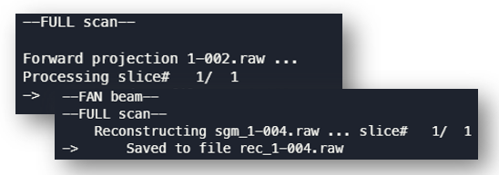

# mangoct-cmake

<p align="center">
    </img>
</p>

This is a fork version of [mangoct](https://github.com/ustcfdm/mangoct) tomography reconstruction toolkit, with compilation toolchain transferred from Visual Studio to cross-platform CMake. Then, **working on Linux is possible**. And since no OS related libraries and features are used, **this might also compile on Windows** (but not tested yet).

## Prerequisites

- GCC with `<filesystem>` or `<experimental/filesystem>` and C++ 17 support
- CMake > 3.18
- NVIDIA GPU with CUDA > 10

## Installation

- Clone

  ```sh
  git clone git@github.com:z0gSh1u/mangoct-linux.git --recursive # recursive to include rapidjson
  ```

  or download

  ```
  https://github.com/z0gSh1u/mangoct/archive/refs/heads/cmake.zip
  ```

- Use [CMake](http://cmake.org/) to configure

  - Set `CMAKE_CUDA_COMPILER` to your `nvcc`, configure.

  - Check the correct CUDA is selected if there are multiple CUDAs on your system. Most `CUDA_*_LIBRARY` should points to somewhere in your CUDA installation path.

  - Align `CMAKE_CUDA_ARCHITECTURES` according to your GPU's [Compute Capability](https://developer.nvidia.com/cuda-gpus) to get best performance and avoid errors.

  - Set `CMAKE_INSTALL_PREFIX` to the path where compiled binary files should be saved.

  - *Maybe* you need to remove `stdc++fs` library link if your compiler fully supports `<filesystem>` header with only `-std=c++17` flag.
  
    ```cmake
    # mgfpj/CMakeLists.txt and mgfbp/CMakeLists.txt
    target_link_libraries(<project_name>
        ${CUDA_LIBRARIES}
        stdc++fs # Remove this line for GCC > 8.2 which fully supports <filesystem>
    )
    ```
  
- Generate, go to the generated folder, and

  ```sh
  make
  make install
  ```

- mangoct executables (mgfpj, mgfbp) will compile to `<CMAKE_INSTALL_PREFIX>/bin/`

## Usage

Please refer to the [latest upstream Windows version of mangoct](https://gitee.com/njjixu/mangoct) for detail.

- Forward projection using mgfpj.

  ```sh
  ./mgfpj config_mgfpj.jsonc
  ```

- FBP / FDK reconstruction using mgfbp.

  ```sh
  ./mgfbp config_mgfbp.jsonc
  ```

## Current Upstream Version

mangoct now use [gitee.com/njjixu/mangoct](https://gitee.com/njjixu/mangoct) as upstream and shares commit histories. It's up-to-date now (1.2).

